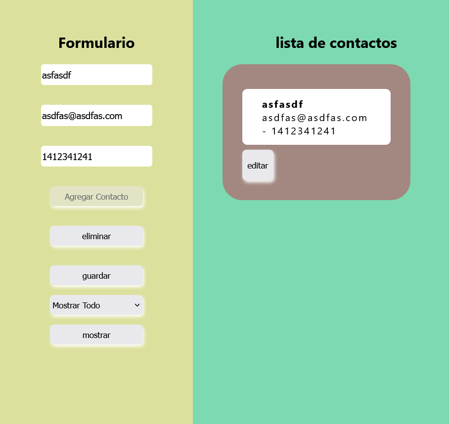

# Generador de Contactos


Este proyecto permite crear, guardar y visualizar una lista de contactos personalizados desde el navegador. Gracias al uso de tecnologías web y localStorage, los datos se mantienen almacenados incluso después de cerrar la página.

#### [👀 Miralo aquí](https://arm4nd7.github.io/generador-contactos-PuArWe-6/)
## 🚀 Partida
En este proyecto puedes encontar:

    ▫️Formulario de ingreso para nuevos contactos con nombre, número y correo.
    ▫️Visualización de todos los contactos guardados. 
    ▫️Visualización de todos los contactos guardados
    ▫️Opción para eliminar contactos individualmente.
    💾 Almacenamiento local mediante localStorage.
    
##  Construido con 🛠️

✔️ `HTML 5` para dar estructura a la página.<br>
✔️ `CSS` para dar estilo a la página y los componentes.<br>
✔️ `JS Vanilla` para dar dinamismo e interactividad a la página.<br>
✔️ `Material Design` uso de coleres y estilos.

Cómo funciona❓<br>
La aplicación está compuesta por:
1. **Formulario de ingreso:** permite llenar la información de un nuevo contacto.
2. **Lista de contactos:** muestra todos los contactos almacenados en tarjetas individuales.
3. **Botón de eliminación:** cada tarjeta tiene su propio botón para borrar el contacto.
4. **Persistencia local:** los datos no se borran al cerrar o recargar la página, ya que están almacenados en el localStorage.

## 🏗️ Estructura
```
generador-contactos/
├── src/
│   ├── index.html          # Estructura de página
│   ├── styles.css          # Estilos y diseño
│   └── script.js           # Dinamismo y lógica.
├── package-lock.json
├── package.json
└── README.md               # Documentacion
```

## Gratitud 🎁
* Gracias [👀 Material Design](https://m2.material.io/design/color/the-color-system.html) para el uso de los estilos y colores.
* Gracias [👀 Repositorio Buscador paises](https://arm4nd7.github.io/Buscador-Paises-PuArWe-4/) para el resurso de logia JS.
* Gracias [👀 MDN web docs](https://developer.mozilla.org/en-US/docs/Web/API/Window/localStorage) explicaciones y recursos y ejemplos.
